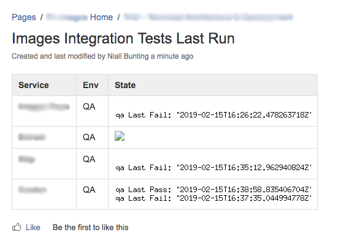

# GoQANotifier

A small go program that stores the outcome of QA integration tests. Data can be retrieved as png.

This just allows us to see when the tests were last run on a bamboo page.

## Getting Started

```
// Install the dependancies
$ go get github.com/fogleman/gg
$ go get github.com/gorilla/mux

// Build and run
$ go build src/main.go
$ ./main
```

## Example


